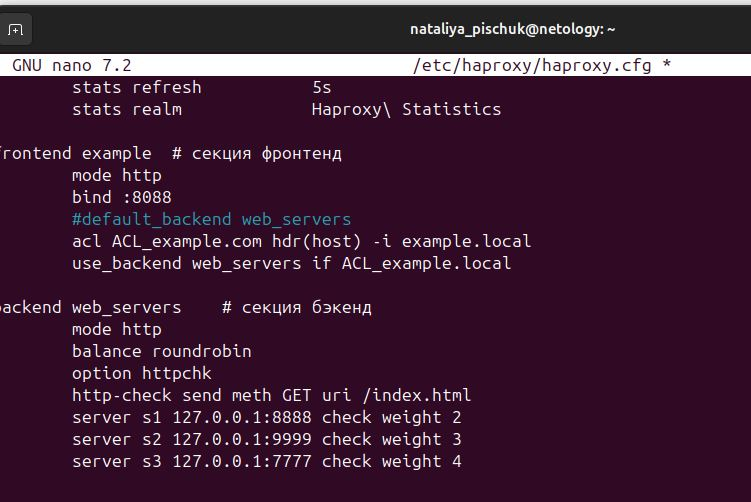
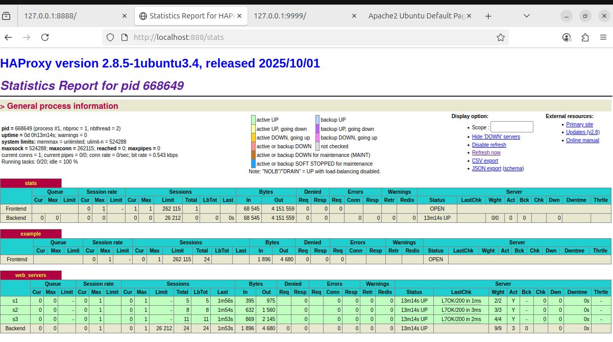
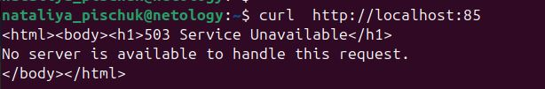

# Домашнее задание к занятию "Кластеризация и балансировка нагрузки" - Пищук Наталья
### Задание 1
#### Запустите два simple python сервера на своей виртуальной машине на разных портах
#### Установите и настройте HAProxy, воспользуйтесь материалами к лекции по ссылке
#### Настройте балансировку Round-robin на 4 уровне.
#### На проверку направьте конфигурационный файл haproxy, скриншоты, где видно перенаправление запросов на разные серверы при обращении к HAProxy.

### Решение 1
1. Пользуемся материалами с лекции и создаем две директории
mkdir http1
mkdir http2

2. Необходимо установить haproxy
   sudo apt-get install haproxy
3. Запускаем два python-сервера с разными портами. Один с портом 8888, другой с портом 9999
   Все настройки выполнены в соответствии с лекциями
  
  
  
4. В соответствии с уловиями лекциии прозводим настройку файла haproxy.cfg
   https://github.com/nataliya-pischuk/Klaster2/img/haproxy.cfg
   
5. Проверяем в браузере страницу со статистикой и убедился, что всё работает.
  

### Задание 2
#### Запустите три simple python сервера на своей виртуальной машине на разных портах
#### Настройте балансировку Weighted Round Robin на 7 уровне, чтобы первый сервер имел вес 2, второй - 3, а третий - 4
#### HAproxy должен балансировать только тот http-трафик, который адресован домену example.local
#### На проверку направьте конфигурационный файл haproxy, скриншоты, где видно перенаправление запросов на разные серверы при обращении к HAProxy c использованием домена example.local и без него.
### Решение 2

1. Добавляю 3-ю диркторию http3, и делаем по аналогии с первым заданием: создаю файл index.html с содержанием: Server 3 :7777. Переходим в директорорию и запускаю Python-server
Открываю через редактор nano конфигурационный файл haproxy

#### sudo nano /etc/haproxy/haproxy.cfg
2. Вношу изменения. Указываю веса у серверов и указываю домен example.local
  
  Перезагружаю сервис
  
 #### sudo systemctl reload haproxy

3. Отправляю запрос к домену example.local и получаю балансировку по весу серверов:
   #### curl -H 'Host:example.local' http://127.0.0.1:8088
  
 
  
  
4. Если же сделать запрос без указания хоста указанного в настройках, то возникает ошибка
     
